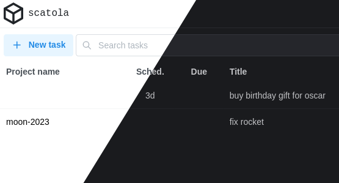

# Scatola



Web-based task manager inspired by taskwarrior.


## Local development

Contributions are really appreciated, please refer to the [CONTRIBUTING guidelines](./CONTRIBUTING.md).

1. install dependencies, because of Remix issues with other package managers **npm** is mandatory

```sh
npm i
```

2. Setup prisma and SQLite

```sh
npm run setup
```

3. Start dev server:

```sh
npm run dev
```

This starts your app in development mode, rebuilding assets on file changes.


## Credits

- Based on [Remix Indie Stack](https://github.com/remix-run/indie-stack/)
- UI Components from [Mantine](https://github.com/mantinedev/mantine/)
